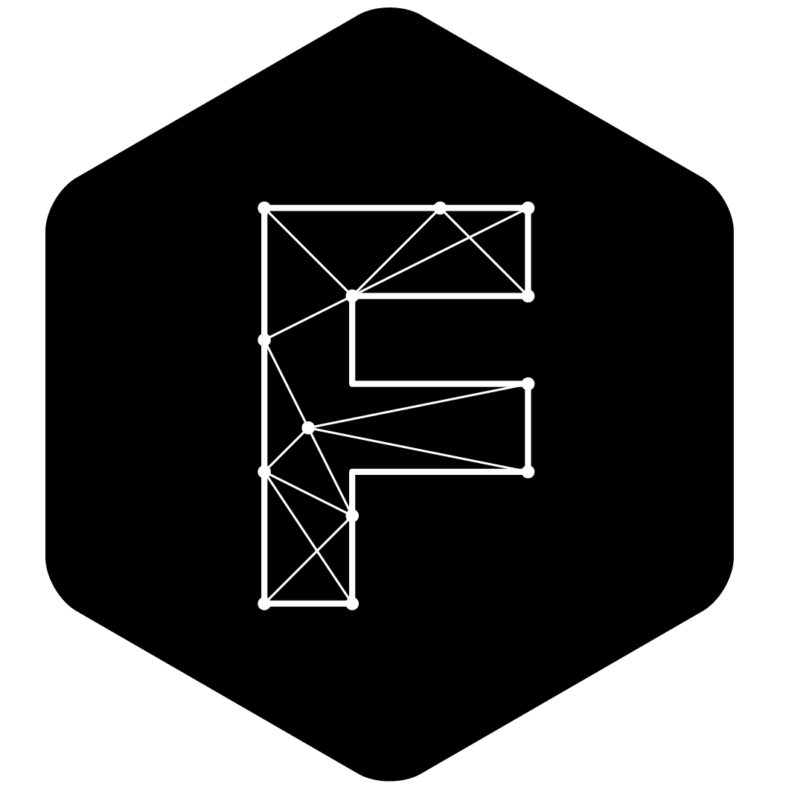

<div align="center">

# faebryk

<a href="https://github.com/faebryk/faebryk">

</a>
<br/>

Open-source software-defined EDA tool

[](https://github.com/faebryk/faebryk/releases) [](https://github.com/faebryk/faebryk/blob/main/LICENSE) [](https://github.com/faebryk/faebryk/pulls) [](https://github.com/faebryk/faebryk/issues)
[](https://discord.com/channels/907675333350809600) [](https://pypi.org/project/faebryk/) [](https://github.com/faebryk/faebryk/commits/main)

[](https://github.com/psf/black)

</div>

---

## About

### What \[is faebryk\]

faebryk is an open-source software-defined EDA (electronic design automation) tool.
Think of it like the next step from EDA tools like KiCAD, Altium, Eagle...
in the way those were the next step from designing electronic circuits on paper.
While the main focus is on the EDA part currently, faebryk aims to become a wholistic system design tool.
The main concept of faebryk consists of **describing your system** instead of describing its implementation, and iteratively providing implementation details as needed.

### How \[does faebryk work\]

faebryk itself is just a **python library** that you include in your project. It is providing you with all the tools to describe and design your system and to export that design into something useful like for example a netlist, a devicetree, gerbers etc, which you then can use in the next steps of your project. Key concepts of faebryk are the graph, importers, exporters, the library and the user application.
To understand how to use faebryk in your project see #Using faebryk.

### Who \[is faebryk\]

faebryk is a community driven project. That means faebryk does not only consist out of core developers but also users, external contributors, moderators and you! It is founded by a group of embedded, electrical, product design and software engineers with a love for making.

### Why \[do we make faebryk\]

The founders of the project noticed that the innovations of software engineering that make fast, scalable, robust solutions possible have not found their way into hardware design. Furthermore there is a lot of duplicate work done. Think of determining the pinout of a SoC and then having to translate that exact pinout into software again, or having to constantly adapt designs for supply chain issues.
Next to that they have assessed that hardware design has quite a big barrier of entry for makers which is not necessary or desirable.
Currently hardware design is also quite manual labor intensive with very little automation.
faebryk aims to tackle all those issues and more like proper version management and collaboration.

### When \[is faebryk being developed\]

faebryk is being continuously developed.
The core team focuses on the core functionality and features of faebryk, and general direction of the project.
The strength of the community can really shine with the development of importers, exporters, libraries, and projects, but everyone is welcome to help out where they can.
faebryk uses semantic versioning in the releases.

### Where \[do we develop faebryk\]

faebryk is being developed completely in the open on Github.
All the information you need to start using and contributing to faebryk will be in or linked to from this repository.
If you have any questions you can ask them on our [Discord](https://discord.gg/95jYuPmnUW).
For pull requests and bug-reports, see our [contributing guidelines](docs/CONTRIBUTING.md).

---

## Using faebryk

### From pip

Setup

```bash
> pip install faebryk
```

Running samples

```bash
> mkdir my_faebryk_project
> cd my_faebryk_project
> # download a sample from the github repo in /samples
> python3 <sample_name.py> | tail -n1 > netlist.net
```

### From source

Setup

```bash
> git clone git@github.com:faebryk/faebryk.git
> cd faebryk
> git submodule init
> git submodule update
> pip install -r requirements.txt
```

Running samples

```bash
> ./samples/<sample_name>.py | tail -n1 > netlist.net
```

---

## Contributing

See [CONTRIBUTING.md](docs/CONTRIBUTING.md)

To get inspiration on things to work on check out the issues.

### Running your own experiments/Making samples

First follow the steps in get running from source.
Then add a file in samples/ (you can use one of the samples as template).
Call your file with `python3 samples/<yourfile>.py`.

### Running tests

Setup

```bash
> pip install -r test/requirements.txt
```

Run

```bash
> python3 test/test.py
```

## Community Support

Community support is provided via Discord; see the Resources below for details.

### Resources

- Source Code: <https://github.com/faebryk/faebryk>
- Chat: Real-time chat happens in faebryk's Discord Server. Use this Discord [Invite](https://discord.gg/95jYuPmnUW) to register
- Issues: <https://github.com/faebryk/faebryk/issues>
